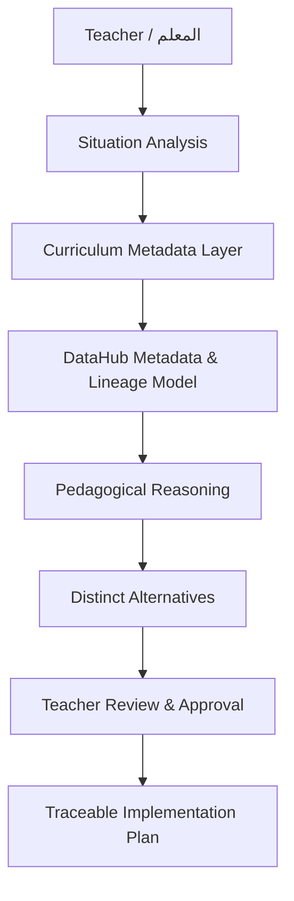

# ZAHRAA™ Teacher Decision Lab

**Decision Before Generation™ — القرار قبل التوليد**

[](https://zahraa-teacher-decision-lab-ai.vercel.app/)
[](LICENSE)
[](#prototype-scope)

ZAHRAA™ Teacher Decision Lab is a human-centered educational decision-governance prototype. Instead of generating a lesson plan immediately, it first helps the teacher analyze the instructional situation, review curriculum evidence, compare pedagogically distinct alternatives, approve a decision, and only then generate an implementation plan.

مختبر قرار المعلم ZAHRAA™ هو نموذج أولي لحوكمة القرار التربوي. لا يبدأ بإنشاء خطة درس مباشرة، بل يمر بتحليل الموقف، ومراجعة أدلة المنهج، ومقارنة بدائل تربوية مختلفة، ثم اعتماد المعلم للقرار قبل إنشاء خطة التنفيذ.

## Why it matters | لماذا هذا المشروع؟

Most AI lesson-planning tools optimize for rapid content generation. That can hide the pedagogical choices behind the output and reduce teacher agency.

This project introduces a different workflow:

> **AI suggests. Teachers decide.**

The core principle is that a lesson plan should be the result of a reviewed pedagogical decision—not a direct response to a prompt.

## Core workflow | مسار العمل

```text
Situation Analysis
        ↓
Curriculum Metadata Evidence
        ↓
Pedagogical Alternatives
        ↓
Teacher Review and Approval
        ↓
Traceable Implementation Plan
```

بالعربية:

```text
تحليل الموقف
      ↓
أدلة البيانات الوصفية للمنهج
      ↓
البدائل التربوية
      ↓
مراجعة المعلم واعتماده
      ↓
خطة تنفيذ قابلة للتتبع
```

## How DataHub fits | دور DataHub

The prototype models DataHub as the metadata and lineage layer that organizes curriculum assets and their relationships, including:

- learning outcomes;
- teacher guidance;
- assessment policy;
- curriculum standards;
- grade level;
- conceptual progression;
- relationships between curriculum entities.

These relationships form the evidence context used to explain why pedagogical alternatives are presented and how an approved decision is connected to the final plan.

### Important implementation note

This repository is a **front-end, metadata-driven prototype** that demonstrates the intended DataHub-powered reasoning and traceability workflow. It does **not** claim a production DataHub deployment, live graph queries, or real-time API retrieval in its current version.

## Key features

- **Decision before generation:** no implementation plan is produced before teacher approval.
- **Three pedagogically distinct alternatives:** conceptual, diagnostic, and structured approaches.
- **Evidence visibility:** curriculum evidence categories are shown alongside each alternative.
- **Human decision gate:** the teacher reviews the selected decision and explicitly approves it.
- **Decision lineage:** the workflow connects context, metadata evidence, alternatives, approval, and implementation.
- **Dynamic plans:** the final plan changes according to the selected alternative.
- **Arabic-first bilingual interface:** Arabic RTL experience with supporting English labels for evaluators.
- **Judge view:** a concise explanation of the product logic and DataHub role.

## Decision Journey

1. `scenario.html` — teacher enters grade, subject, lesson, learning outcome, challenge, duration, and notes.
2. `alternatives.html` — the prototype presents three pedagogically distinct alternatives.
3. `teacher-approval.html` — the teacher reviews and explicitly approves the decision.
4. `implementation-plan.html` — a traceable plan is generated from the approved decision.

## Demo scenario

The current demonstration uses a mathematics scenario for Grade 4:

- **Challenge:** students execute procedural steps without understanding.
- **Alternatives:**
  1. Visual Conceptual Approach;
  2. Common-Error Analysis;
  3. Structured Repartitioning.
- **Decision:** the teacher reviews one alternative and approves it.
- **Output:** a lesson implementation plan aligned to that decision.

## Architecture



A more detailed architecture note is available in [`docs/architecture.md`](docs/architecture.md).

## Technology

- HTML5
- CSS3
- Vanilla JavaScript
- `sessionStorage` for passing the selected alternative through the demo journey
- Google Fonts (Alexandria)
- Vercel for static deployment
- DataHub metadata and lineage concepts represented in the prototype workflow

No front-end framework or build step is required.

## Run locally

### Option 1: Open directly

Open `index.html` in a modern browser.

### Option 2: Use a local server

```bash
python -m http.server 8000
```

Then open:

```text
http://localhost:8000
```

## Recommended test path

1. Open `index.html`.
2. Select **ابدأ رحلة اتخاذ القرار**.
3. Review the three alternatives.
4. Expand one alternative and select it.
5. Complete the professional decision charter.
6. Approve the decision.
7. Generate the implementation plan.
8. Verify that the final plan matches the selected alternative.

Repeat the flow with each alternative to see the dynamic plan change.

## Repository structure

```text
.
├── index.html
├── alternatives.html
├── teacher-approval.html
├── implementation-plan.html
├── LICENSE
├── README.md
├── DEVPOST_SUBMISSION.md
├── VIDEO_SCRIPT.md
├── docs/
│   ├── architecture.md
│   └── demo-guide.md
└── examples/
    ├── README.md
    ├── curriculum-metadata-example.json
    ├── decision-trace-example.json
    └── lesson-plan-output.md
```

## Example outputs

The [`examples`](examples/) folder contains transparent sample artifacts so judges can inspect the intended metadata, lineage, and output quality without running the interface.

These examples are illustrative prototype artifacts, not exports from a live production DataHub instance.

## Prototype scope

### Implemented

- complete interactive decision journey;
- dynamic alternative selection;
- teacher approval gate;
- alternative-specific implementation plans;
- metadata evidence and traceability presentation;
- responsive static web deployment.

### Future work

- connect to an operational DataHub instance;
- ingest real curriculum assets and metadata;
- execute graph-based retrieval and lineage queries;
- add authentication and teacher workspaces;
- export a decision report;
- evaluate decisions with classroom outcome data.

## Live demo

**Vercel:** https://zahraa-teacher-decision-lab-ai.vercel.app/

## Video

Add the public or unlisted YouTube/Vimeo demo link here before final Devpost submission:

```text
VIDEO_URL_HERE
```

Test the video in an incognito window to confirm it works without sign-in.

## Author

**Dr. Zahra Idris Al-Ansari**  
Founder, Zahraa Al-Ansari Academy  
Educational AI, teacher development, and human-centered intelligent education.

## License

Licensed under the [Apache License 2.0](LICENSE).
