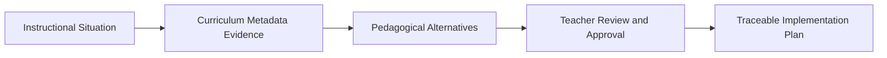

# ZAHRAA™ Teacher Decision Lab

**Decision Before Generation™**  
**AI suggests. Teachers decide.**

[Live Demo](https://zahraa-teacher-decision-lab-ai.vercel.app/) · [Public Repository](https://github.com/Zahraishag/zahraa-teacher-decision-lab-ai)

## Overview

ZAHRAA™ Teacher Decision Lab is a human-centered educational decision prototype that helps teachers analyze an instructional situation, compare pedagogically distinct alternatives, explicitly approve a professional decision, and only then generate an implementation plan.

The core idea is simple:

> Generative AI should not begin with content generation. It should begin with structured pedagogical reasoning and preserve the teacher's authority over the final decision.

## Problem

Many AI lesson-planning tools move directly from a prompt to a single generated plan. That workflow can hide assumptions, collapse distinct teaching philosophies into one answer, and reduce the teacher's role to reviewing generated content after the main pedagogical decision has already been made.

ZAHRAA™ Teacher Decision Lab reverses that sequence.

## Solution

The prototype presents a transparent workflow:

1. **Situation Analysis** — identify the grade, subject, learning challenge, and decision context.
2. **Metadata Evidence** — represent the curriculum evidence categories that should inform the decision.
3. **Pedagogical Alternatives** — compare three genuinely different instructional approaches, including their strengths and limitations.
4. **Teacher Approval** — require an explicit human decision gate before generation.
5. **Traceable Implementation** — generate a plan that remains linked to the approved decision and represented evidence categories.

## Why DataHub?

DataHub provides the metadata, relationship, governance, and lineage concepts needed for a trustworthy educational reasoning layer. In the intended architecture, curriculum assets such as learning outcomes, teacher guides, assessment policies, grade-level expectations, and curriculum relationships are modeled as governed metadata and connected through lineage.

That structure allows an agent to:

- discover relevant curriculum assets;
- retrieve related pedagogical evidence;
- preserve source relationships and lineage;
- generate distinct alternatives from traceable evidence;
- record the teacher-approved decision;
- connect the final plan back to its decision provenance.

### Current implementation status

This repository contains a **front-end, metadata-driven prototype** of that workflow. It demonstrates the interaction model, decision governance, evidence representation, state transfer, and traceability experience using HTML, CSS, JavaScript, and `sessionStorage`.

A live DataHub ingestion pipeline, graph query service, and production agent backend are **not yet implemented** in this repository. The files in [`examples/`](examples/) illustrate the proposed metadata and lineage outputs without claiming live DataHub API execution.

## Product Flow



## Key Features

- **Decision Before Generation™** workflow.
- Three pedagogically distinct alternatives rather than one immediate answer.
- Visible evidence categories for every alternative.
- Human-in-the-loop approval gate.
- Professional decision charter before plan generation.
- Dynamic plan generation for each selected alternative.
- Decision lineage, evidence verification, and plan provenance.
- Arabic-first RTL interface with bilingual evaluation labels.
- Responsive static web application deployable on Vercel or any static host.

## Demo Scenario

The current prototype uses a Grade 4 Mathematics scenario:

- **Challenge:** students can follow procedures but do not understand the underlying concept.
- **Alternatives:**
  - Visual Conceptual Approach
  - Common-Error Analysis
  - Structured Repartitioning
- **Outcome:** the final implementation plan changes according to the teacher-approved alternative.

## Technology

- HTML5
- CSS3
- Vanilla JavaScript
- Browser `sessionStorage` for cross-page decision state
- Google Fonts — Alexandria
- GitHub for source control
- Vercel for static deployment

No external JavaScript framework or backend is required for the current prototype.

## Repository Structure

```text
.
├── index.html
├── alternatives.html
├── teacher-approval.html
├── implementation-plan.html
├── examples/
│   ├── README.md
│   ├── curriculum-metadata-example.json
│   ├── decision-lineage-example.json
│   └── sample-output.md
├── docs/
│   ├── ARCHITECTURE.md
│   ├── DEVPOST_SUBMISSION.md
│   ├── VIDEO_SCRIPT_AR.md
│   └── SUBMISSION_CHECKLIST.md
├── LICENSE
└── README.md
```

## Run Locally

### Option 1 — Open directly

Open `index.html` in a modern browser.

### Option 2 — Use a local static server

```bash
python -m http.server 8000
```

Then open:

```text
http://localhost:8000
```

## Test the Decision Flow

Run the complete workflow three times:

1. Open `alternatives.html`.
2. Select one alternative and approve it.
3. Continue to `teacher-approval.html`.
4. Confirm that the same alternative appears.
5. Complete the professional decision charter.
6. Approve the decision and generate the plan.
7. Confirm that `implementation-plan.html` displays the matching plan.
8. Repeat for `card1`, `card2`, and `card3`.

## Example Outputs

The [`examples/`](examples/) directory contains illustrative, non-production samples of:

- curriculum metadata representation;
- decision lineage;
- a teacher-approved implementation output.

These examples are included so judges can inspect the intended quality and traceability model without running a backend.

## Hackathon Submission

- **Event:** Build with DataHub: The Agent Hackathon
- **Challenge category:** Select exactly one category on Devpost before submission.
- **Demo video:** Add the public YouTube, Vimeo, or Youku URL here after upload.
- **Live project:** https://zahraa-teacher-decision-lab-ai.vercel.app/

Copy-ready submission text and the Arabic three-minute video script are available in [`docs/`](docs/).

## Roadmap

- Ingest curriculum documents and policy assets into DataHub.
- Model learning outcomes, grade levels, teacher guides, and assessment policies as governed metadata entities.
- Query relationships and lineage through a backend service.
- Connect an educational reasoning agent to DataHub evidence retrieval.
- Persist teacher decisions and plan provenance.
- Add authentication, multi-curriculum support, audit logs, and exportable decision reports.

## Responsible AI Principles

- Human judgment remains authoritative.
- Evidence should be visible and reviewable.
- Generation follows explicit approval.
- Metadata claims must be traceable.
- The prototype does not present illustrative values as live production results.

## License

Licensed under the [Apache License 2.0](LICENSE).

## Author

**Dr. Zahraa Al-Ansari**  
Founder, Zahraa Al-Ansari Academy  
Creator of the ZAHRAA™ Human-Centered Educational Intelligence approach
