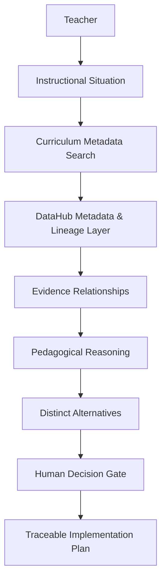
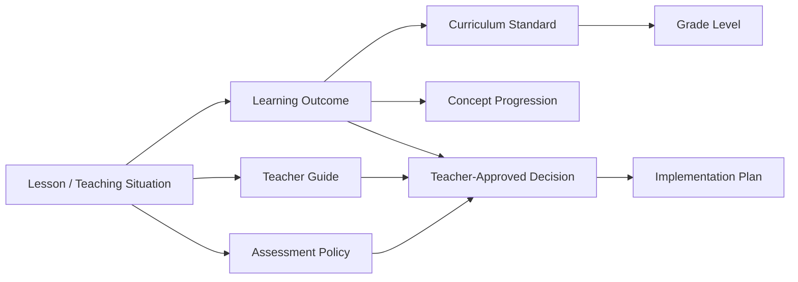

# Architecture

## Conceptual architecture



## Data model represented by the prototype



## Current implementation

The current build is a static front-end prototype. It represents metadata categories, evidence relationships, approval state, and decision lineage in the user experience.

`sessionStorage` carries the selected alternative between:

```text
alternatives.html
    → teacher-approval.html
    → implementation-plan.html
```

## Intended DataHub integration

A production implementation would:

1. ingest curriculum documents and assets;
2. register them as DataHub entities or related metadata assets;
3. define relationships among learning outcomes, standards, guides, assessment rules, activities, and grade levels;
4. query relevant evidence for the current instructional situation;
5. preserve lineage from source assets to alternatives, approved decision, and final plan;
6. expose provenance for teacher review and governance.

## Trust boundary

The agent may retrieve, compare, and propose. The teacher remains responsible for approving the pedagogical decision before implementation content is generated.
