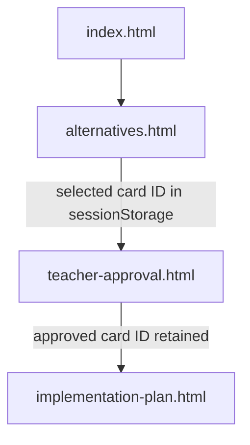
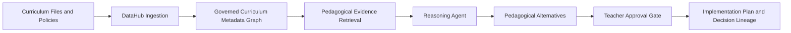

# Architecture

## Current Prototype

The current build is a static front-end prototype:

- HTML and CSS render the Arabic-first bilingual interface.
- Vanilla JavaScript controls cards, approval gates, loading transitions, and navigation.
- `sessionStorage` carries the approved alternative across pages.
- Each alternative maps to a distinct implementation-plan data object.

## Intended DataHub-Powered Architecture

## Proposed Metadata Entities

- Curriculum document
- Learning outcome
- Teacher guide section
- Assessment policy
- Grade level
- Curriculum standard
- Learning progression
- Pedagogical alternative
- Teacher-approved decision
- Implementation plan

## Proposed Relationships

- `learning_outcome -> supported_by -> teacher_guide`
- `assessment_policy -> measures -> learning_outcome`
- `grade_level -> constrains -> learning_progression`
- `curriculum_standard -> governs -> learning_outcome`
- `pedagogical_alternative -> grounded_in -> evidence_asset`
- `teacher_decision -> selects -> pedagogical_alternative`
- `implementation_plan -> derived_from -> teacher_decision`

## Trust Boundary

The prototype deliberately separates:

- **system-represented evidence categories**, which are read-only; and
- **teacher professional approval**, which requires explicit interaction.

The production system should never treat generated content as approved until the teacher decision event has been recorded.
